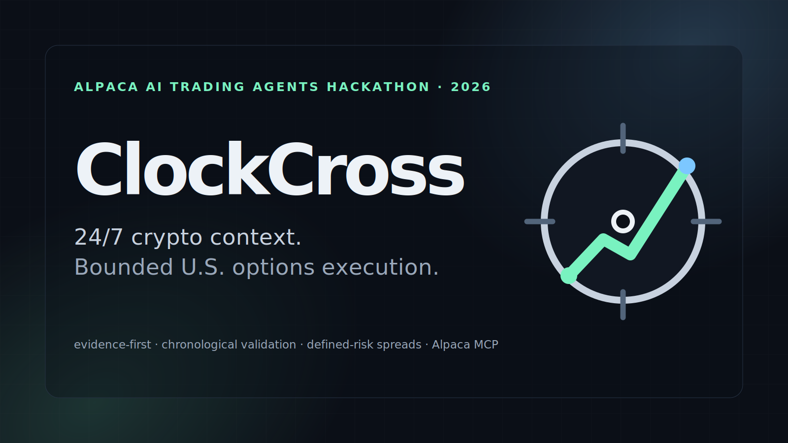

# ClockCross

<p align="center">
  
</p>

**An autonomous AI options agent that measures crypto-to-equity repricing gaps, validates them chronologically, and expresses only evidence-backed COIN signals through defined-risk Alpaca spreads.**

ClockCross was built for the **Alpaca AI Trading Agents Hackathon**. It uses Alpaca's paper-trading stack, Alpaca MCP, and an authenticated Cloudflare Workers AI gateway backed by a schema-bounded Llama 3.3 70B model while keeping trade construction, risk, order lifecycle, and idempotency deterministic.

> Paper trading is a simulation. Nothing in this repository is investment advice, and the research results do not imply future performance.

**Judge demo:** https://clockcross-demo.tomi-seregi99.workers.dev — a static, zero-secret evidence surface showing the frozen research results, negative evidence, autonomous architecture, Alpaca integration, risk envelope, and verified development preflight/safety proofs. It exposes no trading controls or live account connection.

**Submission assets:** [`docs/SUBMISSION_PACKAGE.md`](docs/SUBMISSION_PACKAGE.md) — canonical Lablab copy, public image URLs, demo/repository links, video structure, and final submission handoff.

## Why ClockCross

BTC trades continuously while U.S. equity options do not. The naive idea — “BTC moved overnight, so buy a crypto-sensitive stock at the open” — is rejected because COIN and MSTR already reprice before the regular session.

ClockCross instead estimates the expected equity move from recent BTC/equity beta, measures the **unexplained premarket residual**, and asks whether that residual is large enough to enter a bounded decision pipeline.

```text
BTC 24/7 data
  -> rolling BTC/COIN beta
  -> 09:25 ET COIN premarket residual
  -> chronological evidence gate
  -> 09:30–09:40 opening confirmation
  -> current 7–21 DTE COIN option-chain feasibility
  -> read-only Alpaca MCP context/news
  -> bounded AI: continuation | reversion | abstain
  -> deterministic vertical-spread constructor
  -> deterministic risk governor
  -> idempotent Alpaca paper MLeg entry
  -> bounded entry reconciliation/cancellation
  -> deterministic 10:55 ET research-horizon exit
  -> idempotent exact-contract MLeg close
  -> durable SQLite lifecycle ledger
```

## What the research actually found

The first real Alpaca historical run covered **2025-01-02 through 2026-08-28** using consolidated SIP equity data and returned **`MUTATE`**, not `GO`.

| Surface | OOS signals | Mean signed underlying return | Current interpretation |
| --- | ---: | ---: | --- |
| COIN | 82 | +27.46 bps | **Live candidate after mutation** |
| MSTR | 65 | +31.40 bps | Negative/rejection evidence: 2026 weakened |
| QQQ | control | -1.56 bps | Broad-market falsification control |

The important regime split was COIN: its 2026 test episodes averaged approximately **+84.07 bps across 38 signals**, while MSTR's 2026 episodes deteriorated to approximately **-22.72 bps**. Both tickers failed the intentionally severe **100 bps underlying-friction** gate. ClockCross does not erase or relabel that failure.

The approved mutation therefore makes **COIN the only execution-eligible underlying** and replaces the generic friction question with a live **options-feasibility gate** using the actual Alpaca chain. The frozen live signal policy is the modal recent continuation configuration: beta-40, raw residual, 1% threshold.

A later literal day-by-day replay of the current policy used the actual Alpaca market calendar from **2026-03-02 through 2026-09-01**: 128 market days, 39 residual signals, and 36 AI-directed trades. Raw continuation was **22-17 with +15.9 bps mean 60-minute directional COIN return**; the current bounded AI policy was **21-15 with +50.7 bps mean directional return** and three abstentions. The same AI was negative in June and July but strongly positive in May and August, so the repository preserves the regime weakness instead of hiding it. A three-repeat stability pass across all 23 June–Sep signal contexts produced **zero action flips across 69 deployed-gateway calls**. Full methodology and limitations are in [`docs/research/2026-09-01-end-to-end-backtest.md`](docs/research/2026-09-01-end-to-end-backtest.md).

Evidence is committed under [`artifacts/research/`](artifacts/research/) and [`docs/research/`](docs/research/).

## AI authority is deliberately narrow

The model sees a schema-bounded context only after deterministic evidence and option-chain feasibility pass. It may return:

- `continuation`
- `reversion`
- `abstain`

It cannot choose a new symbol, invent a contract, change DTE, change position sizing, bypass stale quotes, override buying power, exceed portfolio risk, choose an exit, or submit an order directly. Malformed output, transport errors, company-specific news, or ambiguous context fail closed to `abstain`.

The AI endpoint is a small authenticated Cloudflare Worker at `clockcross-ai-gateway.tomi-seregi99.workers.dev`. The Worker fixes the provider model to Cloudflare's Llama 3.3 70B fast variant, requests the exact ClockCross JSON schema at the provider boundary, validates it again, and returns the OpenAI-compatible response shape consumed by the Python adjudicator. The adjudicator then performs its own Pydantic validation, giving the decision path two independent schema checks.

Alpaca MCP is **read-only inside ClockCross**: trading toolsets are disabled. Atomic multi-leg execution uses Alpaca's Trading REST API because deterministic request validation and `client_order_id` reconciliation are easier to audit there.

## Verified external evidence

A full encrypted cloud preflight on **2026-08-30** passed all five external surfaces against the development paper account:

- paper account active and unblocked;
- options approved/trading Level 3;
- **416 COIN option contracts** parsed in the 7–21 DTE window on the indicative feed;
- official Alpaca MCP `get_clock` succeeded;
- the deployed AI gateway returned a schema-valid bounded decision.

The preflight is read-only: it does not create a ledger episode or instantiate the order-execution path.

On **2026-09-01**, the competition workflow completed its first real autonomous paper episode on the dedicated competition account. External preflight passed, the opening MLeg filled, the deterministic research-horizon close filled on its first close attempt, and the persisted episode finished `CLOSED` with reason `research_horizon_exit_filled`.

## Risk and execution

The MVP permits only:

- COIN;
- 7–21 DTE call or put debit spreads;
- 1:1 same-expiration verticals;
- positive bounded net debit;
- limit MLeg orders;
- no 0DTE;
- no uncovered short options;
- one active COIN structure at a time.

Live option eligibility is based only on fields the Alpaca snapshot path actually supplies and records: fresh positive/non-crossed bid/ask quotes, relative spread quality, available delta, valid vertical economics, buying power, and deterministic max-loss gates. ClockCross does not claim to enforce open-interest or volume thresholds that are absent from the normalized live snapshot.

Spread construction is directional but deterministic. The long leg must have approximately **0.45–0.65 absolute delta** and the farther-OTM short must retain at least **0.10 absolute delta**; the latter guard was added after a chronological historical replay exposed a `net_delta / debit` degeneracy that could otherwise prefer near-zero-delta lottery shorts. ClockCross evaluates all quote-eligible farther-OTM shorts at the same expiration, requires at least **0.30 absolute net directional delta**, rejects any debit outside the existing risk-derived one-contract budget, then ranks the remaining verticals by net directional delta per debit with deterministic tie-breakers. If no structure provides meaningful directional exposure inside the existing envelope, it abstains. The ledger records long delta, short delta, net delta, net debit, and delta-per-debit for every selected candidate.

Default risk caps remain **1% of starting equity per position** and **5% aggregate defined loss**. Competition entries must begin inside the frozen 09:55–10:05 ET entry window. An accepted opening MLeg gets a fixed 180-second fill window; an unfilled order is canceled only after cancellation can be proven. A filled spread is managed to the **10:55 ET** exit boundary because the frozen research target is the 60-minute return from the 09:55 decision. The close reuses the exact opening contracts with `sell_to_close` / `buy_to_close`, deterministic client IDs, and at most one deterministic replacement attempt.

The Basic options feed remains a known execution-information limitation: ClockCross selects from Alpaca's `indicative` option snapshots, while paper execution can be evaluated against the current market/NBBO. The constructor therefore treats indicative quote/Greek data as a bounded selection input rather than as a claim of OPRA-quality execution data; the risk limits and fail-closed rules do not assume OPRA access.

Every irreversible order has a deterministic client order ID. A timeout triggers reconciliation by that ID; if the outcome cannot be proven, ClockCross does not blindly re-submit. An unresolved prior COIN lifecycle blocks a new competition episode.

## Run locally

Requires Python 3.12+ and `uv`.

```bash
uv sync --extra dev
cp .env.example .env
```

Set development-paper Alpaca credentials plus the gateway bearer in `LLM_API_KEY`. The checked-in URL/model defaults already point to the verified ClockCross Cloudflare gateway; no AI credential is committed. Never use the final hackathon account for destructive integration tests.

Research:

```bash
uv run clockcross research --start 2025-01-02 --end 2026-08-28 \
  --output-dir artifacts/research
```

Read-only external preflight — safe to run while markets are closed and does **not** create a ledger episode or call an order endpoint:

```bash
uv run clockcross preflight
```

It checks the paper account state, Level-3 options permission, parseability of the current 7–21 DTE COIN chain, read-only Alpaca MCP `get_clock`, and the configured AI provider/schema. Exit code is `0` only when all five checks pass.

One autonomous dry run:

```bash
uv run clockcross run-once --date 2026-08-31 --mode dry-run
```

Development-account paper execution requires the explicit environment opt-in:

```text
CLOCKCROSS_ACCOUNT_ROLE=development
CLOCKCROSS_ALLOW_DEV_ORDER=true
```

Competition mode uses a fresh dedicated `$100,000` paper account and **must not** set the development-order flag:

```text
CLOCKCROSS_ACCOUNT_ROLE=competition
CLOCKCROSS_ALLOW_DEV_ORDER=false
```

The complete competition lifecycle is:

```bash
uv run clockcross competition-session --date YYYY-MM-DD
```

The checked-in `.github/workflows/competition-runtime.yml` is the event-bounded launcher on `main`. Automatic cron scheduling was removed after unreliable delayed/dropped GitHub scheduled runs. The canonical trigger is now a path-scoped push changing `ops/competition-run-now`; `workflow_dispatch` is the recovery path. The workflow still rejects dates outside Aug 31 and Sep 1–4, restores prior SQLite state, performs read-only preflight first, and then executes `competition-session`. ClockCross itself remains the final time authority and refuses new entries after 10:05 ET.

Crash recovery is intentionally separate and cannot compute or submit a new signal:

```bash
uv run clockcross reconcile --date YYYY-MM-DD
```

Read-only evidence console:

```bash
uv run clockcross serve --host 0.0.0.0 --port 8000
```

See [`docs/OPERATIONS.md`](docs/OPERATIONS.md) before any paper execution.

## Tests

```bash
uv run pytest -q
uv run ruff check .
uv run mypy src/clockcross
```

The suite covers leakage boundaries, option-chain normalization, directional spread selection, minimum short-leg delta and minimum net-delta abstention, risk-derived constructor budgets, AI fail-closed behavior, Cloudflare gateway contract constraints, risk caps, state-machine legality, SQLite idempotency, opening/closing order uncertainty, exact-contract exits, competition timing, restart-safe lifecycle recovery, workflow secret isolation, public API redaction, live-signal freezing, account-role safeguards, read-only external preflight, and repository secret scanning.

## Project documents

- [`docs/ONE_PAGE_WRITEUP.md`](docs/ONE_PAGE_WRITEUP.md) — hackathon technical summary
- [`docs/OPERATIONS.md`](docs/OPERATIONS.md) — runbook and account discipline
- [`docs/SUBMISSION_PACKAGE.md`](docs/SUBMISSION_PACKAGE.md) — ready-to-paste Lablab fields and public visual assets
- [`docs/SUBMISSION_CHECKLIST.md`](docs/SUBMISSION_CHECKLIST.md) — final submission gate
- [`docs/research/2026-08-29-initial-alpaca-run.md`](docs/research/2026-08-29-initial-alpaca-run.md) — immutable first-run interpretation
- [`docs/research/2026-08-29-live-signal-policy.json`](docs/research/2026-08-29-live-signal-policy.json) — frozen live policy
- [`docs/research/2026-09-01-end-to-end-backtest.md`](docs/research/2026-09-01-end-to-end-backtest.md) — literal daily replay, six-month evidence, AI stability, option-price limitations, and constructor hardening

## License

MIT. See [`LICENSE`](LICENSE).
