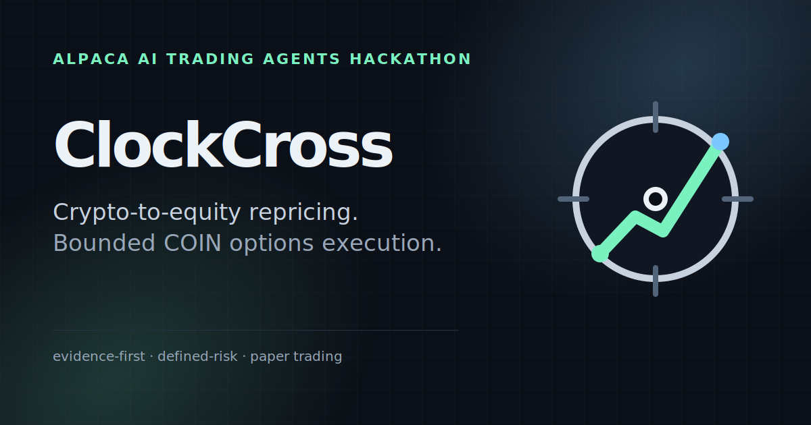

# ClockCross Submission Package

  

Canonical copy-and-asset handoff for the Alpaca AI Trading Agents Hackathon submission.

> Keep the project evidence-first. Do not replace `MUTATE` with a stronger claim, do not imply live-money trading, do not convert underlying-direction diagnostics into account returns, and do not invent historical option fills where Alpaca does not expose arbitrary-past snapshot BBO/Greeks.

## Project title

**ClockCross — Evidence-Gated Autonomous Options Agent**

## Short description

ClockCross turns BTC-to-COIN repricing gaps into bounded Alpaca option spreads only after chronological falsification, bounded AI adjudication, and deterministic risk gates.

## Long description

ClockCross is an autonomous AI options-trading agent built for the Alpaca AI Trading Agents Hackathon. It starts from a specific cross-market timing question: BTC trades continuously while U.S. equity options do not. Instead of blindly following overnight BTC direction, ClockCross estimates COIN's expected premarket move from prior-session BTC/COIN beta and trades only the unexplained residual that survives deterministic evidence gates.

The research process is deliberately falsification-first. The first real Alpaca historical run returned `MUTATE`, not `GO`: COIN retained useful out-of-sample evidence, MSTR weakened materially in 2026, QQQ remained a broad-market control, and the intentionally severe 100 bps underlying-friction gate failed. ClockCross preserved that negative evidence and narrowed execution to COIN instead of tuning until the broad thesis looked positive.

After the first autonomous competition episode, ClockCross ran a literal six-month chronological replay of the final decision policy over 128 actual Alpaca market days. It produced 39 signals, 36 AI trades, 3 AI abstentions, 6 data abstentions, and 83 threshold abstentions. The current AI finished 21-15 with a 58.3% directional hit rate and +50.7 bps mean chosen-direction 60-minute COIN return versus frozen continuation at 22-17 and +15.9 bps mean. June (-38.3 bps) and July (-57.1 bps) remained losing AI regimes and are shown explicitly rather than tuned away. These are underlying-return diagnostics, not compounded account returns.

The backtest also found a real production-selection defect. The existing net-delta/debit objective could prefer extremely far-OTM ~0.00-0.02-delta shorts, producing 50-60 point-wide spreads with weak historical short-leg print coverage. ClockCross promoted exactly one structural fix: a **0.10 minimum absolute short-leg delta** applied consistently to option feasibility and deterministic construction. It retained candidates on all five recent signal days, improved historical entry-print coverage from 40% to 80%, reduced mean width from 56.9 to 29.4 points, and preserved mean net delta near 0.370. A 12,000-trial post-fix indicative-surface stress produced zero risk-invariant violations. Signal threshold, beta, AI prompt/model, risk budget, decision window, and 10:55 exit remained frozen.

A live episode checks the cross-market signal, opening confirmation, and a current 7–21 DTE COIN option chain, gathers read-only Alpaca MCP context, and asks a schema-bounded AI adjudicator for exactly one of three outputs: `continuation`, `reversion`, or `abstain`. The model cannot choose symbols, contracts, DTE, sizing, order prices, or exits. A deterministic spread constructor enforces approximately 0.45–0.65 absolute long delta, at least 0.10 absolute short delta, at least 0.30 absolute net directional delta, defined-risk debit economics, and the existing risk-derived one-contract budget.

Competition entries are restricted to 09:55–10:05 ET. An opening Alpaca MLeg gets a fixed 180-second fill window and is canceled only when cancellation can be proven. A filled position exits at 10:55 ET using the exact opening contracts in a deterministic closing MLeg. Lifecycle state is persisted in SQLite so restarts reconcile known order identities instead of recomputing a signal or blindly retrying an ambiguous order.

The first real competition episode ran on **2026-09-01**: the dedicated account passed preflight, the opening MLeg filled, the deterministic research-horizon close filled on its first close attempt, and the persisted lifecycle finished `CLOSED`. No unresolved opening/closing order remained and no undocumented manual trade-selection intervention occurred. This remains paper trading; final competition equity/P&L must come from the dedicated event account rather than from research diagnostics or proxy returns.

The public judge demo is deliberately static and zero-secret. It exposes the falsification record, six-month replay, losing regimes, backtest-discovered constructor defect, bounded fix, Alpaca integration, deterministic risk envelope, and verified competition lifecycle without exposing trading controls, credentials, or a live account connection.

## Historical option proxy — disclosure wording

Alpaca historical option bars/trades do not reproduce arbitrary-past snapshot BBO/Greeks, so ClockCross does **not** claim an exact historical options-fill backtest. Historical trade prints are used only as a transparent price/liquidity proxy.

After the 0.10 short-delta fix, two recent signal days had enough prints on both selected legs for a full 09:55–10:55 proxy:

- **2026-08-18:** +$120 raw / +$100 after a $0.20 spread-friction stress.
- **2026-08-21:** +$59 raw / +$39 after the same stress.
- **2026-08-07, 2026-08-24, 2026-09-01:** insufficient prints on both selected legs; label **unobservable**, never win/loss.

## Suggested technology / category tags

- AI Agents
- Algorithmic Trading
- Options Trading
- FinTech
- Alpaca
- Alpaca MCP
- Python
- FastAPI
- Cloudflare Workers AI
- Llama 3.3 70B
- SQLite

## Required links

- **Public GitHub repository:** https://github.com/AKzar1el/clockcross
- **Judge demo platform:** Cloudflare Workers Static Assets
- **Judge demo URL:** https://clockcross-demo.tomi-seregi99.workers.dev
- **Six-month chronological replay:** `docs/research/2026-09-01-end-to-end-backtest.md`
- **One-page technical write-up:** `docs/ONE_PAGE_WRITEUP.md`
- **Operations / account discipline:** `docs/OPERATIONS.md`
- **Submission gate:** `docs/SUBMISSION_CHECKLIST.md`

## Image placement map

### Lablab cover image

Use **`hackathon-cover.png`** — 1600×900 PNG.

  

- Repository source: `deploy/cloudflare-demo/public/hackathon-cover.png`
- Public HTTPS asset: https://clockcross-demo.tomi-seregi99.workers.dev/hackathon-cover.png
- SVG master: `deploy/cloudflare-demo/public/hackathon-cover.svg`

### Website / link preview image

Use **`og-image.png`** — 1200×630 PNG.

  

- Repository source: `deploy/cloudflare-demo/public/og-image.png`
- Public HTTPS asset: https://clockcross-demo.tomi-seregi99.workers.dev/og-image.png
- SVG master: `deploy/cloudflare-demo/public/og-image.svg`

### GitHub social preview

Recommended asset: `deploy/cloudflare-demo/public/og-image.png`.

Upload manually under **Repository → Settings → Social preview → Edit → Upload an image**. The tracked 1200×630 PNG is suitable for the repository preview.

### Logo / application identity

  

- Wordmark: `deploy/cloudflare-demo/public/logo-wordmark.svg`
- Mark: `deploy/cloudflare-demo/public/logo-mark.svg`
- Browser favicon: `deploy/cloudflare-demo/public/favicon.svg`
- Multi-size favicon: `deploy/cloudflare-demo/public/favicon.ico`
- Apple touch icon: `deploy/cloudflare-demo/public/apple-touch-icon.png`
- PWA icons: `deploy/cloudflare-demo/public/icon-192.png`, `deploy/cloudflare-demo/public/icon-512.png`
- Manifest: `deploy/cloudflare-demo/public/site.webmanifest`

## Video presentation structure

Aim for a compact judge-first recording. The differentiation is not “another AI trading dashboard”; it is a traceable falsification-and-correction loop that actually changed production behavior.

1. **0:00–0:25 — Thesis**  
   BTC trades 24/7; COIN options do not. ClockCross measures unexplained repricing instead of blindly following BTC.
2. **0:25–1:00 — The system was allowed to say no**  
   Show `MUTATE`, COIN survival, MSTR deterioration, QQQ control, and the failed 100 bps promotion gate.
3. **1:00–1:45 — Literal six-month replay**  
   Show 128 market days, 36 AI trades / 3 AI abstentions, 21-15, 58.3%, +50.7 bps mean, plus June/July negative regimes.
4. **1:45–2:30 — The backtest found a bug**  
   Show near-zero-delta lottery shorts, the 0.10 short-delta structural floor, width/print-coverage improvement, and 12,000-trial post-fix stress.
5. **2:30–3:10 — Bounded autonomous pipeline**  
   Residual → confirmation → option feasibility → Alpaca MCP → bounded AI → deterministic constructor/risk → Alpaca MLeg → persisted lifecycle.
6. **3:10–3:45 — Real competition episode**  
   Show 2026-09-01 preflight, opening fill, deterministic 10:55 exact-contract close, terminal `CLOSED`.
7. **3:45–4:15 — Alpaca integration + abstention**  
   Show historical/market data, options data, read-only MCP context, Trading API MLegs, threshold/data/AI abstentions, reconciliation, and separate competition-account discipline.
8. **4:15–4:30 — Close**  
   ClockCross is designed to reject weak evidence, expose losing regimes, fix structural defects without parameter mining, and execute only inside a deterministic defined-risk envelope.

## Slide-deck content map

1. **ClockCross** — one-line thesis + cover visual.
2. **The timing problem** — BTC 24/7 vs U.S. option hours; residual rather than naive overnight following.
3. **Research can reject the thesis** — frozen `MUTATE`, COIN/MSTR/QQQ, failed 100 bps gate.
4. **Six-month chronological replay** — 128 market days, 36 AI trades, 3 AI abstentions, 21-15, 58.3%, +50.7 bps; June/July negative regimes visible.
5. **The backtest found a production bug** — near-zero-delta shorts and the 0.10 structural correction.
6. **What changed / what stayed frozen** — short-delta floor changed; signal, AI, timing, risk budget did not.
7. **Autonomous system** — end-to-end architecture diagram.
8. **AI is bounded** — continuation / reversion / abstain; deterministic authority boundaries.
9. **Defined-risk lifecycle** — 7–21 DTE COIN debit spreads, delta gates, risk caps, bounded fill, 10:55 exit, idempotency/recovery.
10. **Alpaca integration + competition proof** — data, MCP, Trading API, verified 2026-09-01 `CLOSED` lifecycle, final event account equity/P&L when available.

## Final fields still pending external/user evidence

- Dedicated competition Alpaca paper account identifier for the submission form.
- Final competition account P&L/equity after the event run is complete.
- Final selected competition trade/abstention screenshots.
- Video URL.
- Slide-deck URL/file.
- Lablab submission URL.

## Final repository handoff

The competition lifecycle and post-episode constructor correction are already merged to `main`. The 0.10 short-delta floor is intentionally narrow: it changes deterministic spread quality/observability while preserving the same signal, AI action set, COIN-only universe, 7–21 DTE window, one-contract sizing, 1%/5% defined-loss envelope, 09:55–10:05 decision window, MLeg lifecycle, and 10:55 ET exit.

GitHub cron scheduling is not part of the operational design. The checked-in competition workflow uses the path-scoped `ops/competition-run-now` push trigger on `main`, with `workflow_dispatch` as recovery, while the application remains the final timing gate.

Before final submission: require green CI on the final merged commit, capture final competition account equity/P&L, add the final account/trade evidence to submission media without exposing secrets, upload the GitHub social preview, complete video/slides, and fill the remaining Lablab fields in `docs/SUBMISSION_CHECKLIST.md`.
